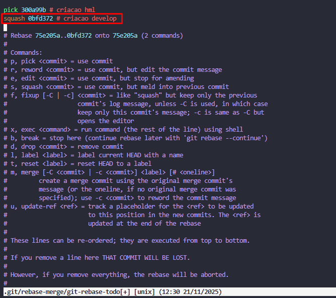

# Git Reset

Funcionamento, sintaxe e aplicação do comando git reset;

## Funcionamento

O `git reset` é uma ferramenta versátil para desfazer alterações, manipulando as "três árvores" do Git: Histórico de Commits (HEAD), Índice de Staging e Diretório de Trabalho.

  * **Mecanismo:** Move o ponteiro do branch atual e do HEAD para um commit específico.
  * **Modos de operação:**
      * `--soft`: Move o HEAD. Mantém o Staging e o Diretório de Trabalho intactos (as alterações voltam como "staged", prontas para commit).
      * `--mixed` (Padrão): Move o HEAD e reseta o Staging. Mantém o Diretório de Trabalho (as alterações voltam como "modified", não preparadas).
      * `--hard`: Move o HEAD e reseta tanto o Staging quanto o Diretório de Trabalho. Descarta todas as alterações permanentemente.

## Sintaxe

```bash
# Resetar um arquivo específico do staging
git reset <arquivo>

# Resetar o repositório para um commit específico com modo
git reset [--soft | --mixed | --hard] <commit>
```

## Exemplos Práticos

**1. Retirar arquivo do Staging (Unstage)**
Útil quando você dá `git add .` por engano e quer remover um arquivo da preparação sem perder o código.

```bash
# Adiciona tudo
git add .

# Remove apenas 'segredos.env' do staging, mantendo o arquivo na pasta
git reset segredos.env
```

**2. Desfazer último commit (Soft)**
Útil para corrigir uma mensagem de commit ou adicionar mais arquivos ao commit anterior sem perder o trabalho feito.

```bash
# Desfaz o último commit, mas mantém os arquivos verdes (staged)
git reset --soft HEAD~1

# Agora você pode fazer alterações e commitar novamente
git commit -m "Nova mensagem correta"
```

**3. Agrupar commits locais (Mixed)**
Útil para limpar um histórico de "trabalho em progresso" antes de finalizar a tarefa.

```bash
# Você fez 3 commits pequenos de teste
# Volta 3 commits, arquivos ficam modificados na sua máquina
git reset --mixed HEAD~3

# Adiciona tudo de uma vez para um único commit limpo
git add .
git commit -m "Funcionalidade completa refatorada"
```

**4. Descartar alterações (Hard)**
Útil para jogar fora um experimento que deu errado.

```bash
# Apaga todas as alterações (commitadas ou não) e volta 2 commits
git reset --hard HEAD~2
```

## Aplicação

  * **Correção local:** Alterar commits recentes que ainda não foram compartilhados.
  * **Organização:** "Atomizar" ou agrupar commits para deixar o histórico mais limpo.
  * **Gerenciamento de Staging:** Retirar arquivos adicionados incorretamente à área de preparação.
  * **Limpeza:** Restaurar o projeto para um estado limpo e conhecido.

## Cuidados

  * **Perda de dados (`--hard`):** O modo hard é destrutivo. Qualquer alteração no diretório de trabalho ou staging que não tenha sido salva em outro lugar será perdida para sempre.
  * **Histórico Público:** **Nunca** use `git reset` em commits que já foram enviados (push) para um repositório remoto compartilhado. Isso reescreve o histórico e causará conflitos graves para outros desenvolvedores. Para reverter commits públicos, use `git revert`.

## Referência

  * Atlassian - Git Reset 
# Git Log

O git log é um comando usado para exibir o histórico de commits de um repositório Git, listando-os em ordem cronológica inversa (do mais recente para o mais antigo). 
Git SCM

Ele permite filtrar quais commits mostrar por intervalo de revisões (usando notações como A..B ou A...B), por data (--since, --after), por autor ou por caminho de arquivo. 
Git SCM

Também é possível controlar a formatação da saída — por exemplo, com --pretty=oneline (resumo de cada commit em uma linha) ou exibir diffs de cada commit com -p. 
Git SCM

Outras opções úteis incluem:

--follow — para seguir o histórico de um arquivo mesmo após renomeações. 
Git SCM

--no-merges ou --merges — para filtrar commits que são (ou não são) merges. 
Git SCM

--max-count ou -n — para limitar quantos commits serão exibidos. 
Git SCM

## Principais usos:

Inspecionar o histórico de desenvolvimento.

Encontrar quando e por quem uma parte do código foi alterada.

Revisar mudanças específicas com diffs.

Investigar erros ou regressões ao identificar commits problemáticos.

## Exemplos de uso:

git log --no-merges — mostra todos os commits, exceto os de merge. 
Git SCM

git log --since="2 weeks ago" — lista commits feitos nas últimas duas semanas. 
Git SCM

git log --follow caminho/para/arquivo.txt — segue o histórico desse arquivo mesmo se ele foi renomeado. 
Git SCM

git log -p -m --first-parent — mostra os diffs para cada commit, para o ramo principal apenas, ignorando mudanças de ramos mesclados.
# Git Checkout
## Funcionamento, sintaxe e aplicação do comando git checkout
## Funcionalidade:

O comando serve para alternar entre os ramos (branches) ou restaurar arquivos da árvore de trabalho. Sua função principal é atualizar os arquivos na árvore de trabalho para que correspondam à versão no índice ou em uma árvore determinada (commit), atualizando também o HEAD para definir o ramo especificado como o atual. Além disso, pode ser usado para criar novos ramos e alternar para eles imediatamente ou para inspecionar commits antigos


## Sintaxe:
```bash
# Mudança entre ramos
git checkout [-q] [-f] [-m] [<ramo>]

# Criar novo ramo
git checkout [-q] [-f] [-m] [[-b|-B|--orphan] <novo-ramo>] [<ponto-de-partida>]

# Modo desanexado (detached HEAD)
git checkout [-q] [-f] [-m] --detach [<ramo>]
git checkout [-q] [-f] [-m] [--detach] <commit>

# Restauração de arquivos
git checkout [-f|--ours|--theirs|-m|--conflict=<estilo>] [<árvore>] [--] <pathspec>…​

# Modo interativo
git checkout (-p|--patch) [<árvore>] [--] [<pathspec>…​]
```

## Aplicação:

#### 1. Troca entre Ramificações
```bash
git checkout develop          # Muda para ramo 'develop'
git checkout -b nova-feature  # Cria e muda para novo ramo
```

#### 2. Restauração de Arquivos
```bash
git checkout arquivo.txt           # Restaura do índice
git checkout HEAD~1 arquivo.txt    # Restaura de commit anterior
git checkout -- '*.js'             # Restaura múltiplos arquivos
```

#### 3. Inspeção de Commits Antigos

```bash
git checkout a1b2c3d              # HEAD desanexado para commit específico
git checkout v2.0                 # HEAD desanexado para tag
```

#### 4. Resolução de Conflitos
```bash
git checkout --ours arquivo.conflict   # Usa nossa versão
git checkout --theirs arquivo.conflict # Usa versão deles
```

#### 5. Modo Interativo para Descarte Seletivo
```bash
git checkout -p  # Descarte interativo de mudanças
```
## Cuidados

Não use `git checkout -f` sem verificar as alterações locais, pois descarta modificações não salvas permanentemente.
No modo "detached HEAD", commits feitos ficam soltos e podem ser perdidos pela coleta de lixo do Git se não forem referenciados.
Ao trocar de branch com conflitos não resolvidos, o checkout pode falhar; use `-m` para tentar mesclagem automática ou resolva os conflitos manualmente primeiro.

## Referência
Git - Checkout
# d) git squash
## Funcionamento, sintaxe e aplicação do comando git squash
- O comando git squash altera o histórico de commits e os agrupa, permitindo um histórico limpo e apenas com os commits essenciais.

- É utilizado em conjunto com o comando `git rebase`, sendo necessário primeiro indicar quais commits sofrerão alteração e então adicionar a anotação `squash` no respectivo commit. 

Fluxo:
```
git rebase -i HEAD~2
```
Irá abrir o editor VIM para alteração dos commits.



Tendo adicionado a anotação `squash`, basta salvar, alterar a mensagem do commit e confirmar. 

Referência: [Youtube - 17. Juntando commits com squash - Git e Github na Vida Real](https://www.youtube.com/watch?v=UO2RFLAId7Y)
# Git cherry-pick
## Funcionamento, sintaxe e aplicação do comando git cherry-pick

### Funcionamento

Quando você executa o comando, o Git identifica as mudanças feitas naquele commit específico e tenta aplicá-las como um novo commit na branch em que você está trabalhando atualmente (HEAD).


Cópia, não referência: Um novo commit é criado com um novo ID (hash), o que significa que o commit original e a cópia são independentes. Se o commit original for alterado posteriormente, a cópia na outra branch não será afetada.

Conflitos: Se as alterações do commit selecionado entrarem em conflito com o código da branch atual, o Git pausará o processo para que você resolva os conflitos manualmente, de forma similar a um git merge ou git rebase.

Múltiplos Commits: É possível selecionar múltiplos commits de uma vez, e o Git os aplicará sequencialmente na ordem especificada. 

### Sintaxe:

```bash
 git cherry-pick <hash_do_commit>
```
### Aplicação:

O git cherry-pick é uma ferramenta poderosa para gerenciar o fluxo de trabalho do Git em cenários específicos, embora não deva substituir métodos como merge ou rebase na maioria dos casos.

- Hotfixes (Correções urgentes): É o caso de uso mais comum. Uma correção de bug urgente é feita em uma branch de desenvolvimento ou hotfix, e essa correção precisa ser aplicada imediatamente na branch principal (master ou main) sem mesclar todo o desenvolvimento em andamento.

- Aplicação seletiva de funcionalidades: Quando apenas uma parte das alterações em uma branch de funcionalidade (feature branch) está pronta para ser integrada em outra branch, o cherry-pick permite a aplicação pontual daquele commit específico.

- Evitar commits indesejados: Em vez de mesclar uma branch inteira que contém commits irrelevantes ou experimentais, você pode selecionar apenas os commits limpos e necessários.

- Restauração de alterações perdidas: Se commits foram acidentalmente removidos ou perdidos, o cherry-pick pode ser usado para reintroduzir essas alterações em uma branch ativa. 
# Git Rebase
## Funcionamento, sintaxe e aplicação do comando git rebase;

## Funcionamento
- O `git rebase` reaplica commits de um branch sobre outro, criando um histórico linear.
- Passos do processo:
  1. Identifica o ancestral comum entre os branches.
  2. Extrai os diffs dos commits do branch atual.
  3. Reseta o branch atual para a nova base.
  4. Aplica os diffs sobre a nova base.
- Resultado: mesmas mudanças, mas sem commits de merge desnecessários.

## Sintaxe

```bash
git checkout <branch>
git rebase <base>
```

### Exemplo simples

```bash
git checkout experiment
git rebase master
```

### Exemplo avançado com --onto

```bash
git rebase --onto master server client
```

**Significado:** reaplica os commits do branch `client` que divergiram de `server`, agora em cima de `master`.

## Aplicação

- Manter histórico limpo antes de enviar ao repositório remoto.
- Reorganizar commits de branches interdependentes.
- Evitar commits de merge desnecessários e facilitar revisão do código.

## Cuidados

- **Não rebase commits já compartilhados** (já enviados ao remoto), pois reescreve histórico.
- Pode gerar conflitos difíceis se outra pessoa baseou trabalho nos commits antigos.

## Referência

[Git - Rebase](https://git-scm.com/book/pt-br/v2/Branches-no-Git-Rebase)
